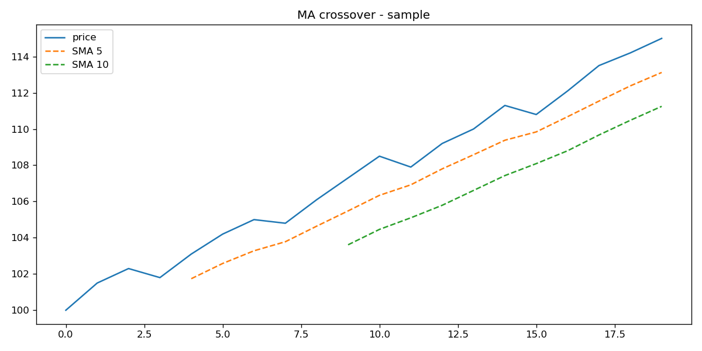

# Moving Average Crossover Strategy

**Purpose:** A Python script that calculates and prints the 5-day and 10-day Simple Moving Average (SMA) for a hard-coded series of stock prices.

**How to run:**
Open your terminal, navigate to the project folder, and run:
`python ma_analysis.py`# ma-crossover-strategy

# MA Crossover Strategy

**What the project does:** A simple Python tool to analyze stock price trends using Simple Moving Averages (SMA) and automatically generate actionable buy/sell signals.

**Methodology:**
This strategy utilizes a 5-day (short-term) and a 10-day (long-term) Simple Moving Average. A "buy" signal is generated when the 5-day SMA crosses above the 10-day SMA (upward momentum). Conversely, a "sell" signal is triggered when the 5-day SMA crosses below the 10-day SMA (downward momentum).

**How to run:**
1. Clone this repository.
2. Open the Jupyter Notebook (`.ipynb` file).
3. Run all cells sequentially to calculate the moving averages and generate the plot.

**Sample Output:**

**Next Steps:**
- Transition from hardcoded data to reading real stock prices from a CSV file (Week 3).